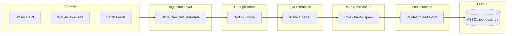

# Job Ingestion & Intelligence Agent — Technical Requirements Document (TRD)

## 1. Document Control and References

| Field | Value |
|-------|--------|
| **Document title** | Job Ingestion & Intelligence Agent — TRD |
| **Version** | 0.1 (Draft) |
| **Status** | Draft — depends on BRD approval and design decisions |
| **Last updated** | 2025-02-11 |

**References:**

- **BRD:** [JOB_INGESTION_AGENT_BRD.md](JOB_INGESTION_AGENT_BRD.md) — scope, success criteria, design decisions to resolve.
- **Foundation document:** Job Ingestion & Intelligence Agent — Project Foundation Document (LLM + ML Hybrid Architecture).
- **Repository (watechcoalition):**
  - [prisma/schema.prisma](../../prisma/schema.prisma) — `job_postings`, `companies`, `company_addresses`, `skills`, `technology_areas`, `industry_sectors`.
  - [app/lib/joblistings.ts](../../app/lib/joblistings.ts) — `createJobListingWithSkills`; job creation flow.
  - [app/lib/openAiClients.ts](../../app/lib/openAiClients.ts) — Azure OpenAI completions and embeddings clients.
  - [app/api/joblistings/add/route.ts](../../app/api/joblistings/add/route.ts) — POST job creation API.
  - [.env.example](../../.env.example) — Azure OpenAI env vars.

---

## 2. Architecture Overview

End-to-end pipeline: **Sources → Ingestion → Deduplication → LLM Extraction → ML Classification → Post-Process & Validation → Output (storage).**



- **Ingestion:** Store raw text + metadata + source + timestamp; idempotency key (e.g. `source` + `external_id`). *FR 5.1*
- **Deduplication:** Exact (hash) + near-duplicate (semantic/fuzzy); canonical ID and lineage. *FR 5.2*
- **LLM extraction:** Azure OpenAI; structured JSON + per-field confidence. *FR 5.3*
- **ML classification:** Job role, seniority, quality score, spam. *FR 5.4*
- **Post-processing:** Normalize title/location/salary; validate required fields; flag low-confidence; overall confidence. *FR 5.5*
- **Output:** Canonical structured job object persisted per BRD “Source of truth” decision. *Section 6 foundation doc*

---

## 3. Integration with watechcoalition

### 3.1 Database

**Current schema:** `job_postings` requires `company_id`, `location_id`, and has optional `employer_id`, `tech_area_id`, `sector_id`, `job_title`, `job_description`, `salary_range`, `location`, `zip`, `county`, M:M `skills`, `occupation_code`, etc. No `source`, `external_id`, confidence, or AI relevance fields today.

**Implementation options (per BRD design decision #4 — Source of truth):**

| Option | Description |
|--------|-------------|
| **A** | Extend `job_postings` with nullable columns: `source`, `external_id`, `ingestion_run_id`, `ai_relevance_score`, `quality_score`, `is_spam`, `overall_confidence`, and optional JSON for field-level confidence. Ingested jobs live in the same table; `employer_id` remains null for ingested jobs. |
| **B** | New table(s) (e.g. `raw_ingested_jobs`, `job_ingestion_runs`) with canonical output; after validation, write to `job_postings` (with same new columns as in Option A). Enables staging and optional “promotion” workflow. |

Related entities to respect: `companies`, `company_addresses`, `skills`, `technology_areas`, `industry_sectors` (see [prisma/schema.prisma](../../prisma/schema.prisma)).

### 3.2 Company and Location Resolution

Ingested jobs supply **company** and **location** as text. Current job creation requires `company_id` and `location_id` (see [app/lib/joblistings.ts](../../app/lib/joblistings.ts)).

**TRD requires one of (per implementation):**

- **Match by name/domain:** Lookup existing `companies` (and optionally `company_addresses` by location text); use if single match; otherwise create or stage.
- **Placeholder company:** Create a minimal company record per distinct (normalized) company name from feed; create or link `company_addresses` from normalized location (city/state or zip).
- **Staging until matched:** Store in staging table with unresolved company/location text; manual or batch resolution before writing to `job_postings`.

Exact strategy TBD in implementation; document choice and fallbacks (e.g. “Unresolved” company placeholder).

### 3.3 Skills Mapping

LLM outputs a **normalized list** of skill names. Existing data model: `skills` (with `skill_subcategories`), M:M with `job_postings` via relation `JobPostingSkills`. Skills have embeddings (Azure OpenAI) used for autocomplete.

**Mapping approach:**

- Match LLM skill strings to existing `skills` by name (exact or normalized) and/or embedding similarity (using existing [app/lib/openAiClients.ts](../../app/lib/openAiClients.ts) embeddings).
- **Fallback:** Define policy: create new skill (if allowed), map to a generic subcategory, or leave unmapped and store only in raw/confidence payload. Document in implementation.

### 3.4 Taxonomy Mapping

Map LLM outputs for **industry**, **seniority**, and **job role** to watechcoalition taxonomy per **BRD design decision #1 (Taxonomy):**

- If **internal:** Map to `industry_sectors` (industry), `technology_areas` (role/area), `pathways` (job family). Seniority may map to a controlled list or remain as text until taxonomy is extended.
- If **SOC:** Map to occupation codes; align with existing `occupation_code` on `job_postings` and any SOC-based roles in the schema.

TRD defers exact mapping tables to implementation; BRD decision drives which tables and codes are used.

---

## 4. Component Specifications

### 4.1 Ingestion Layer

- **API clients:** WaTech API, WorkInTexas API; response normalized to common “raw job” shape (title, body, metadata, source identifier).
- **Batch loader:** Accept batch feeds (e.g. scraped files); same raw shape.
- **Storage:** Persist raw text + metadata + `source` + `ingestion_timestamp`. Idempotency key: `(source, external_id)` to avoid duplicate raw inserts. *FR 5.1*

### 4.2 Deduplication Engine

- **Exact duplicates:** Hash-based (e.g. on normalized title + company + location or on raw body hash).
- **Near-duplicates:** Semantic similarity (embeddings via existing Azure OpenAI embeddings client) and/or fuzzy title/company matching (e.g. Levenshtein or similar).
- **Output:** Canonical job ID; track duplicate lineage (which record is canonical; which are merged/dropped). Target ≥90% duplicate detection accuracy (per BRD). *FR 5.2*
- **Source priority:** Per BRD design decision #9 (Deduplication): source-agnostic vs source-prioritized (e.g. prefer WaTech over scraped when duplicate).

### 4.3 LLM Extraction Layer

- **Provider:** Azure OpenAI (GPT-4 Turbo or deployment per env: `AZURE_OPENAI_*` in [.env.example](../../.env.example)). Use existing completions client where applicable.
- **Output:** Structured JSON with fields: job title, company, location, salary, skills (normalized list), responsibilities, seniority, industry, AI relevance indicators. Include **per-field confidence** (e.g. 0–1). *FR 5.3*
- **Behavior:** Fail gracefully on missing/unparseable data; retries with backoff; do not block pipeline (flag for review or skip).

### 4.4 ML Classification Layer

- **Classifiers:** Job role classification (SOC or internal taxonomy per BRD #1), seniority classification, quality scoring model, spam/fake detection model. *FR 5.4*
- **Candidate algorithms:** Logistic regression, random forest, gradient boosting; fine-tuned BERT as future option. Where models run: per BRD design decision #2 (ML hosting).
- **Quality scoring:** Field completeness, linguistic clarity, AI keyword density, structural coherence. Output normalized [0,1].
- **Fallback:** If model unavailable, skip scoring and/or flag for review (per NFR reliability).

### 4.5 Post-Processing and Validation

- Normalize job titles (taxonomy mapping per BRD #1).
- Standardize locations (city/state format; align to zip/county where needed for `company_addresses`).
- Validate salary ranges (format; optional range checks).
- Enforce required fields for persistence (e.g. title, company, location).
- Flag low-confidence entries; generate overall confidence score (e.g. weighted average of field-level and model confidence). *FR 5.5*

---

## 5. Output Schema and Mapping to Persistence

### 5.1 Canonical Structured Job Object (Foundation doc Section 6)

All numeric scores normalized to [0,1].

```json
{
  "title": "Senior Data Analyst",
  "company": "Acme Corp",
  "location": "Seattle, WA",
  "salary": "$110,000 - $130,000",
  "skills": ["SQL", "Python", "Tableau"],
  "seniority": "Senior",
  "industry": "Technology",
  "ai_relevance_score": 0.87,
  "quality_score": 0.92,
  "is_spam": false,
  "source": "WaTech API",
  "confidence": {
    "title": 0.95,
    "skills": 0.88,
    "salary": 0.60
  }
}
```

(Plus optional: responsibilities, raw body, external_id, ingestion_run_id, and overall_confidence if not folded into confidence.)

### 5.2 Mapping to job_postings and Related

| Canonical field | Persistence | Notes |
|-----------------|-------------|--------|
| title | `job_postings.job_title` | Direct (after normalization). |
| company | `companies` + `job_postings.company_id` | Resolution required (Section 3.2). |
| location | `company_addresses` + `job_postings.location_id`, `job_postings.location`, `zip`, `county` | Resolution required (Section 3.2). |
| salary | `job_postings.salary_range` | Direct (validated string). |
| skills | `job_postings.skills` (M:M) | Map to existing `skills` (Section 3.3). |
| seniority | TBD | Per BRD taxonomy; may be stored as text or mapped to pathway/role. |
| industry | `job_postings.sector_id` → `industry_sectors` | Map per BRD #1. |
| ai_relevance_score | New column `ai_relevance_score` | Per Option A/B. |
| quality_score | New column `quality_score` | Per Option A/B. |
| is_spam | New column `is_spam` | Per Option A/B; reject or flag per BRD #8. |
| source | New column `source` | Per Option A/B. |
| confidence | New column `overall_confidence`; optional JSON `field_confidence` | Per Option A/B. |
| external_id | New column `external_id` | Per Option A/B. |
| ingestion_run_id | New column `ingestion_run_id` | Per Option A/B. |

Employer-created jobs leave new columns null; ingested jobs leave `employer_id` null.

---

## 6. Storage and Data Flow

- **Primary store:** MSSQL (watechcoalition default). All canonical job records and related entities live in existing or extended Prisma schema.
- **Vector store:** Optional; per BRD design decision #5 (Storage). If approved, use for semantic dedup (e.g. job embedding + similarity search). Existing skills embeddings are in MSSQL; vector capability may extend to job text.
- **Raw payload:** Retain for audit and replay (table or blob). Design to support idempotent re-runs and debugging.

---

## 7. Observability and NFRs

**Logging (required):** *NFR Observability*

- LLM latency and token usage
- Extraction failures (count, sample)
- Classification confidence distribution
- Deduplication decisions (merged/dropped counts)
- Spam flags and quality score distribution

**Metrics / SLOs:** *NFR Performance, Reliability*

- Batch ingestion: 1,000 jobs &lt; 5 minutes.
- Individual scoring: &lt; 2 seconds per job (async acceptable).
- Idempotent ingestion (same source + external_id no duplicate insert).
- Graceful LLM fallback (retry then flag/skip).
- ML fallback if model unavailable (skip or default and flag).

---

## 8. Evaluation Framework

| Component | Metric | Foundation doc Section 8 |
|-----------|--------|---------------------------|
| Deduplication | Precision / Recall | Yes |
| LLM extraction | Field-level F1 | Yes |
| Classification | Accuracy / F1 | Yes |
| Spam detection | Precision | Yes |
| Quality scoring | Correlation with human rating | Yes |

- **Where:** Eval datasets and test harness location TBD per BRD design decision #6 (Evaluation dataset). Optionally in repo (e.g. `tests/eval/` or `data/eval/`) or external store.
- **CI:** Optional CI hook to run eval on prompt/model changes (per BRD #10 versioning).

---

## 9. Security and Operations

- **Credentials:** WaTech, WorkInTexas, and Azure OpenAI (existing) in env; never in code or logs.
- **PII:** Do not log PII from job content; log only aggregate metrics and non-PII identifiers.
- **Rate limits and backoff:** Respect source API limits and Azure OpenAI quotas; exponential backoff on transient failures.

---

## 10. Open Points and Dependencies

Each item below is **blocked or shaped by** a BRD design decision. Implementation must align with resolved BRD choices.

| # | BRD decision (section 9) | TRD impact |
|---|----------------------------|------------|
| 1 | Taxonomy | Mapping of role/seniority/industry to schema (Section 3.4, 5.2). |
| 2 | ML hosting | Where classifiers run; deployment and fallback strategy (Section 4.4). |
| 3 | Batch vs real-time | Ingestion and scoring topology (Section 4.1, 7). |
| 4 | Source of truth | Option A vs B (Section 3.1); company/location resolution flow. |
| 5 | Storage | MSSQL-only vs MSSQL + vector DB for dedup (Section 4.2, 6). |
| 6 | Evaluation dataset | Location and format of eval data (Section 8). |
| 7 | AI relevance ground truth | How to train/evaluate ai_relevance_score. |
| 8 | Spam threshold | Reject vs flag; threshold value (Section 5.2, 4.4). |
| 9 | Deduplication source priority | Which source wins when duplicate (Section 4.2). |
| 10 | Versioning | Prompts and model versioning (Section 4.3, 4.4, 8). |

---

*This TRD is the technical basis for implementation. All new schema changes and ingestion flows must comply with the chosen BRD options and this TRD.*
